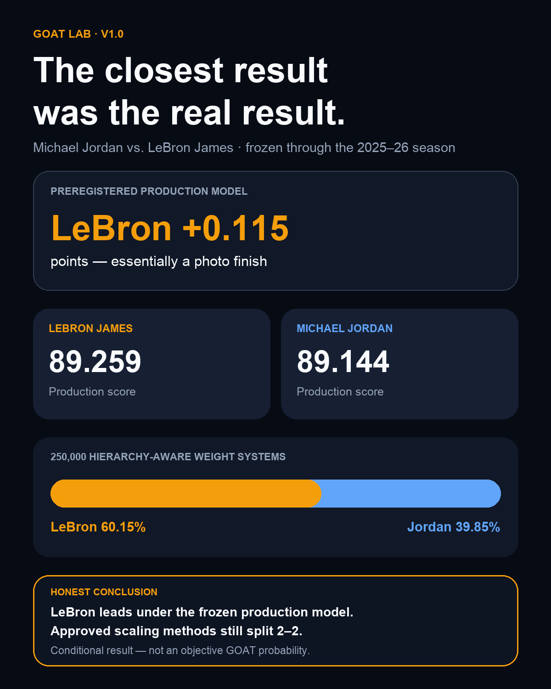
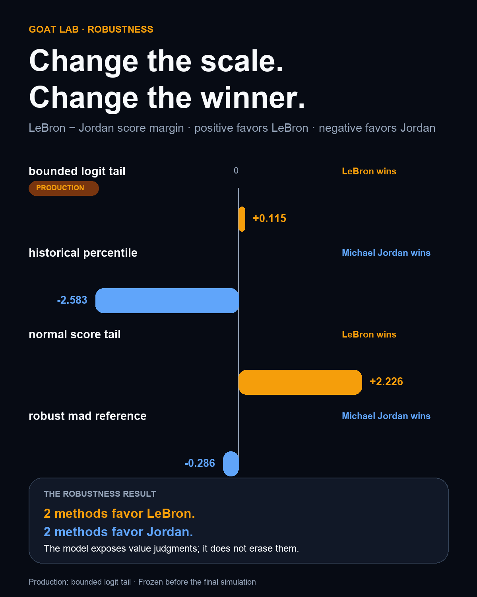

# GOAT Lab — Michael Jordan vs. LeBron James

> **Live interactive demo:** https://goat-lab-jordan-lebron.streamlit.app/
> **Plain-language dashboard guide:** [docs/DASHBOARD_GUIDE.md](docs/DASHBOARD_GUIDE.md)




GOAT Lab is a reproducible basketball-research platform built around a more useful
question than “Who is the GOAT?”:

> Under which defensible definitions of basketball greatness does Michael Jordan or
> LeBron James rank first, and how robust is that conclusion?

## Frozen v1 result

Under the preregistered production model, **LeBron James ranks first by 0.115091
points**. Across **250,000 hierarchy-aware weight simulations**, LeBron wins
**60.1484%** of the sampled value systems and Michael Jordan wins **39.8516%**.

This is a conditional model result—not an objective probability that either player is
the GOAT. The four approved scaling scenarios split 2–2:

| Scaling scenario | Winner | LeBron − Jordan |
|---|---|---:|
| `bounded_logit_tail` *(production)* | LeBron James | +0.115091 |
| `normal_score_tail` | LeBron James | +2.225611 |
| `historical_percentile` | Michael Jordan | -2.582595 |
| `robust_mad_reference` | Michael Jordan | -0.286191 |



Defense is the strongest swing factor toward Jordan. Offense is the largest
counterweight favoring LeBron.

## What the project does

- Builds regular-season and playoff player-season evidence through 2025–26
- Normalizes production per possession and relative to league context
- Separates peak, prime, longevity, regular season, playoffs, offense, defense,
  winning context, and cultural impact
- Uses temporal cross-validation for the playoff-series expectation model
- Prevents unavailable historical evidence from silently becoming zero
- Freezes group caps at 50% Performance Arc, 40% Basketball Value, and 10% Broader Legacy
- Samples weights only within those frozen groups
- Publishes hashes, a machine-readable manifest, limitations, and sensitivity results
- Provides a multi-page Streamlit dashboard and hierarchy-aware weight explorer

## Research principle

The final comparison is a transparent multi-criteria decision analysis, not a
classifier trained on historical GOAT opinions. Machine learning is used only where a
meaningful prediction target exists, such as expected playoff-series outcomes.

The final result was frozen before inspection of the 250,000-run simulation. Expert-film,
game-level playoff, impact-metric, and supporting-cast audits remain diagnostic when
they do not satisfy the preregistered central-model requirements.

## Run the published dashboard

The publication-safe dashboard data is committed under `release/dashboard_data`, so a
fresh checkout does not need to download NBA data or rerun the final simulation.

```bash
python -m venv .venv
source .venv/bin/activate
pip install --upgrade pip
pip install -e '.[dev]'
python scripts/verify_public_release.py
streamlit run app/Home.py
```

## Release QA

```bash
make release-qa
```

This runs Ruff, the full test suite, public artifact verification, deterministic release
asset verification, and dashboard syntax compilation. It does **not** rerun the final
simulation.

## Docker

```bash
docker build -t goat-lab:v1 .
docker run --rm -p 8501:8501 goat-lab:v1
```

Open `http://localhost:8501`.

## Rebuilding the research pipeline

The ingestion and feature pipeline remains available for research development:

```bash
goatlab ingest-core
goatlab build-features
```

`goatlab train-models` cross-fits the playoff model and runs the final simulations.
Do not use it to overwrite the published v1 result. The official v1 artifacts are
identified by the release manifest, artifact hashes, frozen source commit, seed 23, and
the `v1.0.0` tag.

## Key documentation

- `docs/V1_FINAL_RESULTS.md` — final scores, simulation, drivers, and limitations
- `docs/V1_FINAL_PREREGISTRATION.md` — frozen production choices
- `release/v1_release_manifest.json` — machine-readable result and provenance
- `release/v1_artifact_hashes.sha256` — frozen artifact hashes
- `docs/METHODOLOGY.md` — transformations and model design
- `docs/MODEL_CARD.md` — intended use and risks
- `docs/RELEASE_QA.md` — release validation procedure

## Research honesty

Some evidence cannot have equal quality across eras. Official possession and lineup
coverage begins late in Jordan’s career, modern tracking data did not exist during his
peak, and digital attention begins long after it. GOAT Lab labels those gaps, uses
matched windows where possible, and never converts missing evidence to zero.

The strongest honest conclusion is therefore not “the model proved the GOAT.” It is:
**LeBron leads narrowly under the frozen production model, while the winner remains
sensitive to defensible scaling and value choices.**
